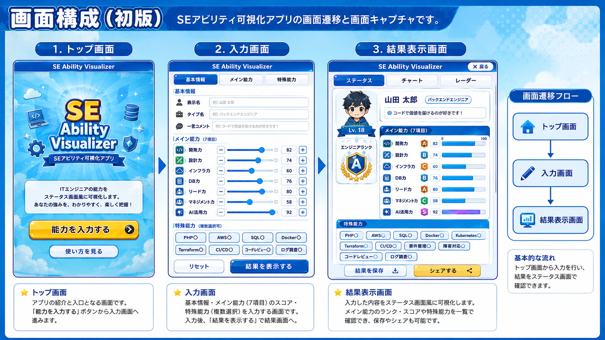

# SE Ability Visualizer

ITエンジニアの能力をゲームのステータス画面風に可視化するWebアプリ。

能力値をスライダーで入力するだけで、S〜Gのランク付きステータスカードが生成されます。
スクリーンショットしてSNSでシェアできます。

**公開URL:** https://se-ability-visualizer.vercel.app/

---

## 画面構成



| トップ画面 | ステータスカード |
|:---:|:---:|
|  |  |

---

## 機能

- 基本情報の入力（表示名・タイプ名・コメント）
- メイン能力 7項目をスライダーで入力（0〜100）
- 特殊能力 20項目をタグで選択
- 入力値に応じた S / A / B / C / D / E / F / G ランク表示
- ステータスカード風の結果画面
- 入力内容の localStorage 自動保存（次回アクセス時に復元）
- PWA対応（スマホのホーム画面に追加可能）

---

## 技術構成

| 項目 | 技術 |
|------|------|
| フレームワーク | React 19 + Vite + TypeScript |
| スタイル | Tailwind CSS v4 |
| PWA | vite-plugin-pwa |
| デプロイ | Vercel |

---

## 開発環境のセットアップ

```bash
npm install
npm run dev
```

ブラウザで http://localhost:5173 を開く。

## ビルド

```bash
npm run build
```

---

## ディレクトリ構成

```
src/
  components/   # UIコンポーネント（StatusCard, MainAbilityForm など）
  pages/        # 画面コンポーネント（TopPage, InputPage, ResultPage）
  data/         # 初期データ（能力項目の定義）
  types/        # 型定義
  utils/        # ユーティリティ（ランク計算, localStorage）
docs/
  app-concept.png               # 画面構成図
  verify-task22.mjs             # Playwright 動作確認スクリプト
  task22-verification-report.md # 初期リリース動作確認レポート
```

---

## MVP 対象外

- ログイン / DB保存
- 診断機能（自動スコア算出）
- AI自動診断
- PDF出力
- SNS自動共有
- 管理画面
