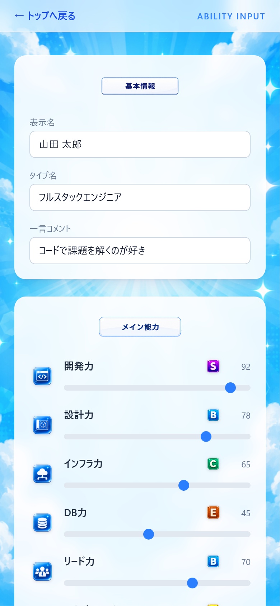
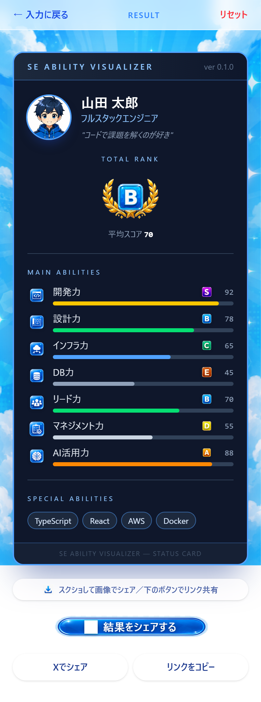

# SE Ability Visualizer

ITエンジニアの能力を、ゲームのステータス画面風に可視化するWebアプリ。

能力値をスライダーで入力するだけで、S〜Gのランク付きステータスカードが生成されます。
スクリーンショットやリンクでSNSにシェアできます。

🔗 **公開URL: https://se-ability-visualizer.vercel.app/**

---

## スクリーンショット

| トップ画面 | 入力画面 | 結果画面（ステータスカード） |
|:---:|:---:|:---:|
|  |  |  |

---

## 主な機能

- 基本情報の入力（表示名・タイプ名・コメント）
- メイン能力 7項目をスライダーで入力（0〜100）
- 特殊能力 20項目をタグで選択
- 入力値に応じた **S / A / B / C / D / E / F / G** ランク表示
- 総合ランク・能力アイコン付きのステータスカード
- **共有導線**（Web Share API・Xシェア・リンクコピー）
- 入力内容の localStorage 自動保存（次回アクセス時に復元）
- **PWA対応**（スマホのホーム画面に追加可能）
- OGP / Twitter Card 対応（SNS共有時のリンクプレビュー）

---

## 技術構成

| 項目 | 技術 |
|------|------|
| フレームワーク | React 19 + Vite + TypeScript |
| スタイル | Tailwind CSS v4 |
| PWA | vite-plugin-pwa |
| アクセス解析 | Vercel Web Analytics |
| デプロイ | Vercel |

---

## 開発環境のセットアップ

```bash
npm install
npm run dev
```

ブラウザで http://localhost:5173 を開く。

## ビルド

```bash
npm run build
```

---

## ディレクトリ構成

```
src/
  components/   # UIコンポーネント（StatusCard, MainAbilityForm, ShareActions など）
  pages/        # 画面コンポーネント（TopPage, InputPage, ResultPage）
  data/         # 初期データ（能力項目の定義）
  types/        # 型定義
  utils/        # ユーティリティ（ランク計算, localStorage, analytics）
public/
  assets/       # アイコン・画像素材（ranks, abilities, icons, backgrounds など）
  icon-192.png  # PWAアイコン
  icon-512.png
  og-image.png  # OGP画像
docs/
  screenshots/  # 各画面のスクリーンショット
```

---

## 今後の改善予定

- 結果カードの画像保存機能（html2canvas など）
- レーダーチャート表示
- 入力値からの簡易自動診断

## MVP 対象外（現時点）

- ログイン / DB保存
- AI自動診断
- PDF出力
- 管理画面
