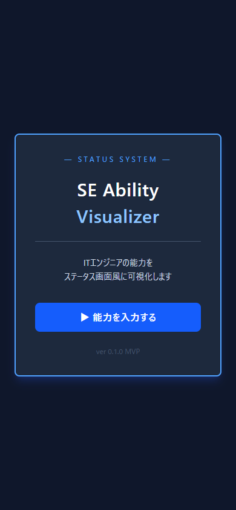
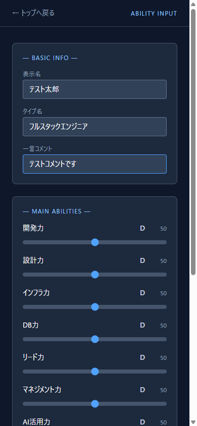
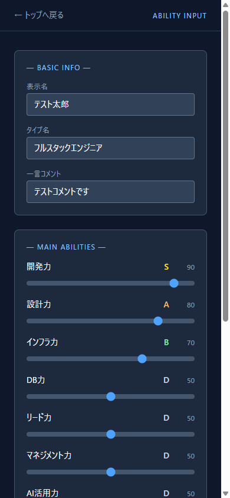
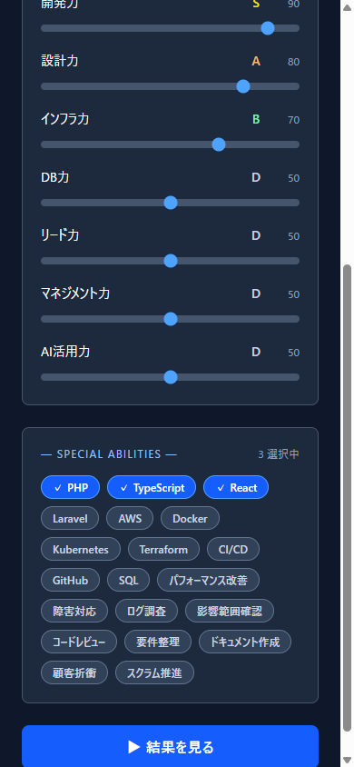
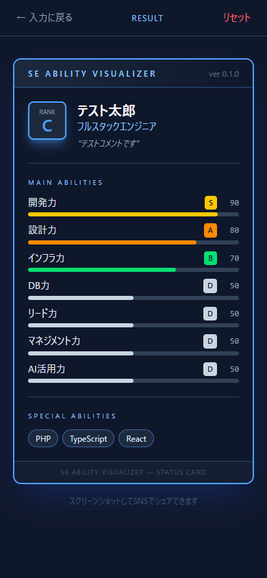
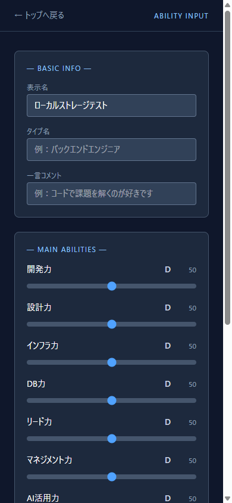

# Task 22 動作確認レポート

**対象URL:** https://se-ability-visualizer.vercel.app/  
**実施日:** 2026-06-06  
**検証ツール:** Playwright (Chromium headful, iPhone 14 Pro viewport 390×844)  
**判定:** ✅ **全項目 PASS**

---

## 確認チェックリスト

| # | 確認項目 | 結果 | 詳細 |
|---|---------|------|------|
| 1 | トップページが表示される | ✅ | title="SE能力可視化", 開始ボタン表示 |
| 2 | 「能力を入力する」で入力ページへ遷移 | ✅ | スライダー7項目表示確認 |
| 3 | プロフィール入力（名前・タイプ名・コメント） | ✅ | テキスト入力3件すべて動作 |
| 4 | スライダー7項目で能力値を変更できる | ✅ | 90/80/70 など正しく反映 |
| 5 | 特殊能力タグを選択/解除できる | ✅ | PHP・TypeScript・React の3件選択 |
| 6 | 「結果を見る」で結果ページへ遷移 | ✅ | 結果ページ（RESULT ヘッダー）表示 |
| 7 | ステータスカードに情報が正しく表示される | ✅ | 名前・タイプ名・ランク・スコアバー・特殊能力 |
| 8 | 「入力に戻る」で入力ページに戻れる | ✅ | スライダー7項目が再表示 |
| 9 | 「リセット」でトップページに戻れる | ✅ | リセット後トップページへ遷移 |
| 10 | リロード後にlocalStorageから復元される | ✅ | 入力値が正しく復元 |
| 🔍 | 空プロフィールで結果ページを開けるか | 🔍 | バリデーションなし（空でも遷移可能）※MVP仕様内 |

---

## スクリーンショット

### 1. トップページ

### 2. 入力ページ（プロフィール入力後）

### 3. スライダー入力

### 4. 特殊能力タグ選択

### 5. ステータスカード（結果画面）

### 6. localStorage復元（リロード後）

---

## 所見

- スマホ viewport（390×844）でレイアウトが崩れず表示される
- ランクバッジの色分け（S=黄, A=橙, B=緑, D=グレー等）が視覚的にわかりやすい
- 空プロフィールでも結果ページへ遷移できる（バリデーションなし）。MVP定義の対象外のため問題なし

---

*Playwright headful mode (slowMo: 300ms) で自動検証*
